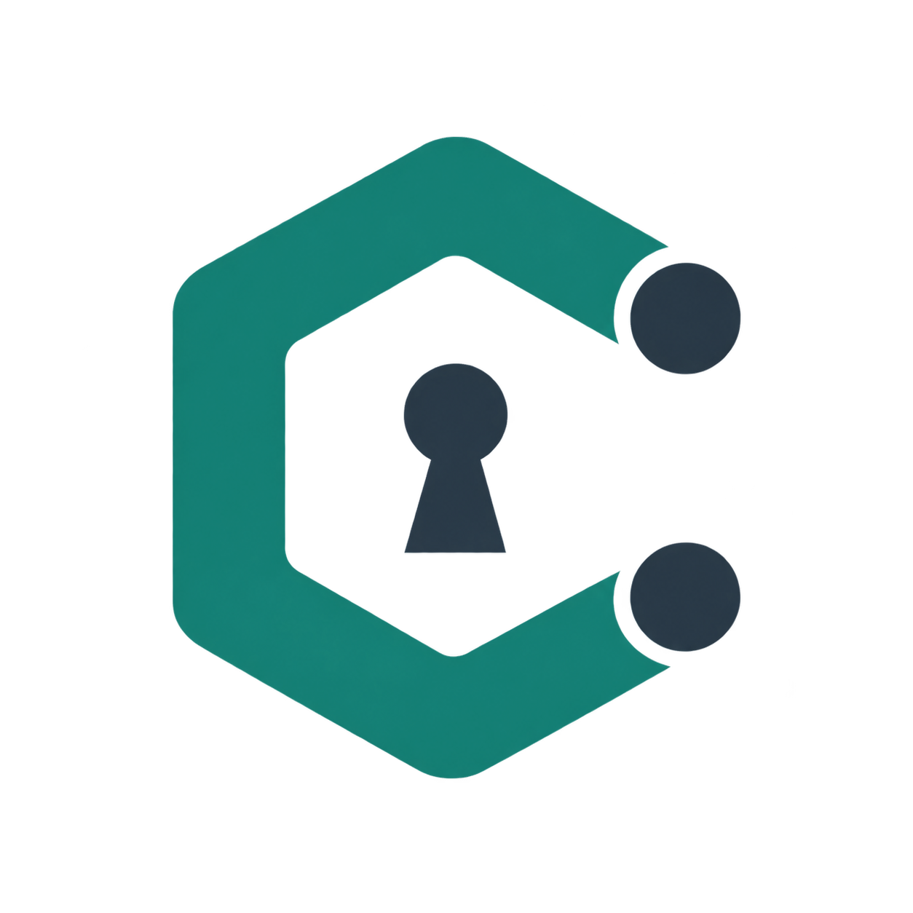
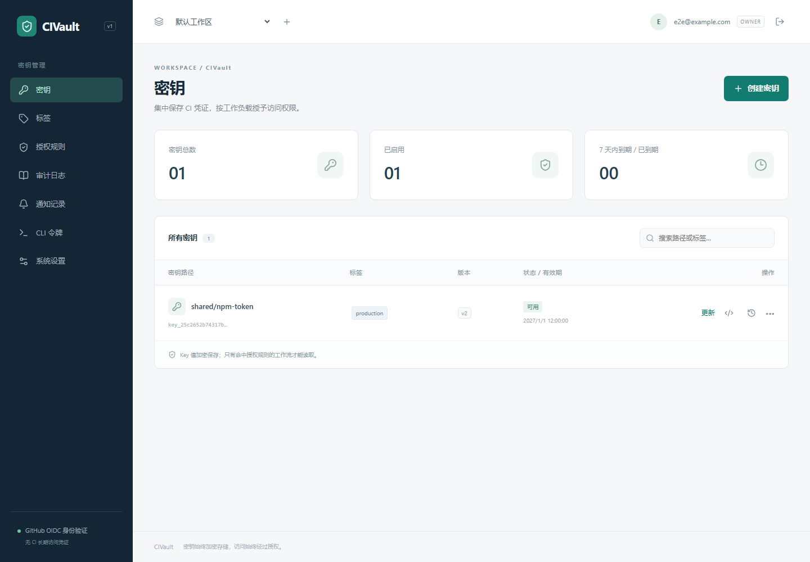

<p align="center">
  
</p>

# CIVault

[](LICENSE)

基于 GitHub Actions OIDC 的 CI Secrets Manager。Go + SQLite 单服务，内嵌中文 React / TypeScript 控制台，附带 HTTP CLI、加载型 Action 和 exec Action。

服务器只有一个必须提供的环境变量：`CIVAULT_MASTER_KEY`。Owner、GitHub OAuth、Resend、到期提醒、站点 URL 和日志设置均在页面维护。没有 Bundle、Redis、云 KMS 或独立 Worker。



## Docker 启动

需要 Docker Compose，以及用于正式访问的现有 HTTPS 入口。

1. **生成一次并妥善保留主密钥**。以下命令会创建 `.env`，不要在已有实例上重新运行覆盖旧主密钥。

   Bash：

   ```bash
   umask 077
   printf 'CIVAULT_MASTER_KEY=%s\n' "$(openssl rand -base64 32)" > .env
   ```

   PowerShell 7：

   ```powershell
   $vaultKey = [Convert]::ToBase64String([Security.Cryptography.RandomNumberGenerator]::GetBytes(32))
   Set-Content -LiteralPath .env -Value "CIVAULT_MASTER_KEY=$vaultKey"
   Remove-Variable vaultKey
   ```

2. 启动唯一服务，读取一次性初始化码：

   ```bash
   docker compose up -d --build
   docker compose exec -T civault cat /data/setup-token
   ```

3. 打开 `http://127.0.0.1:8080/setup`，或经过 HTTPS 入口打开 `/setup`。填写初始化码、Owner 邮箱、至少 12 字节的密码和最终站点 URL。正式使用时站点 URL 必须为 HTTPS origin，例如 `https://secrets.example.com`，不含子路径。
4. 登录后进入「系统设置」，配置 GitHub OAuth、Resend 和提醒策略。

默认仅将容器 8080 映射到宿主机 loopback，数据库保存在命名卷 `civault-data` 的 `/data/civault.db`。容器以 UID/GID `10001` 运行，根文件系统只读。若使用宿主机目录代替命名卷，需要赋予该 UID 数据目录的读写权限。

初始化后文件失效并删除，`POST /v1/setup` 返回 409；重启不会再次开放入口。主密钥缺失、长度不正确或与现有数据库不匹配时，进程退出并返回非零状态。**恢复数据库必须使用原来的主密钥。**

## 控制台

| 页面     | 功能                                                                             |
| -------- | -------------------------------------------------------------------------------- |
| 密钥     | 创建、更新版本、激活历史版本、禁用、删除、有效期、标签、复制引用和 Workflow 示例 |
| 标签     | 稳定 ID、重命名、查看 Key 数量；被任何规则版本引用的 Tag 不能删除                |
| 授权规则 | Key 或 Tag 目标、当前覆盖预览、GitHub 身份和条件、版本、启停                     |
| 审计日志 | 事件、时间、仓库和决策筛选；分页及 JSON 导出                                     |
| 通知记录 | 待发送、重试、已发送、已取消、失败及结果未知状态                                 |
| CLI 令牌 | 默认 30 天、只显示一次、即时撤销                                                 |
| 系统设置 | 站点、Owner、OAuth、Resend 测试邮件、提醒、日志、账户密码                        |

Key 明文仅在写入表单中输入，保存后管理页面和管理 API 均不再返回。敏感配置显示「已配置 / 未配置」；保持不变、替换和清除是明确的不同操作。空值或掩码不能当作新凭证保存。配置使用 `revision` 并发检查；另一页面保存后，旧页面会收到冲突提示，需要刷新后重新编辑。

### GitHub 登录

创建 GitHub OAuth App，填写页面显示的回调地址：

```text
https://secrets.example.com/v1/auth/github/callback
```

将 Client ID / Client Secret 填入系统设置并启用。第一次绑定时，GitHub 必须返回与 Owner 邮箱匹配的**已验证邮箱**。绑定后仅接受该数字用户 ID；更改 Owner 邮箱不改变绑定。支持在页面验证本地密码后解除绑定。

系统使用 Authorization Code、state、S256 PKCE；请求 `read:user user:email`。GitHub Access Token 只在本次登录校验中使用，不持久化，也不能当作管理令牌。没有开放注册。Web 会话 8 小时；修改本地密码会撤销所有 Web 会话和 CLI 管理令牌。

### Resend

在 Resend 验证发件域名后，将 API Key 和发件地址填入设置，例如 `CIVault <alerts@example.com>`，启用并保存，再点击「发送测试邮件」。测试邮件和到期通知仅发送给保存的 Owner 邮箱。

默认提前 7、3、1 天以及到期时提醒。每分钟检查一次；停机错过多个档位时只补当前最紧急的一档。邮件只包含 Key 路径、Workspace、版本、到期时间和控制台链接。未启用 Resend 时，控制台仍显示到期状态，Runtime 仍会拒绝过期 Key。

到期、禁用和删除只阻止后续发放；不能收回已进入 Runner 的值，也不会撤销第三方 Token。

## 授权语义

默认拒绝。每条规则只选择 **Key IDs 或 Tag IDs**；多个 Tag 是**任意匹配**，不是全部匹配。Tag 名称只用于展示，规则引用稳定 ID。给 Key 增删 Tag 后，下一次读取和重试立即采用新关系。

- 组织范围：`repository_owner_id`。
- 仓库范围：Owner ID + `repository_id`。
- 工作流范围：仓库身份 + 精确 `.github/workflows/name.yml` 路径。
- 可附加完整 ref、Environment、事件、Runner 类型、40 位 `workflow_sha`。
- 目标与所有非空身份条件同时满足；同一条件内任意值匹配；任意完整规则命中即允许。
- 宽泛授权不会被更窄规则覆盖。`key_ids` 和 `tag_ids` 规则均可独立授予权限。

可以从 GitHub API 获取数字 ID：

```bash
gh api repos/OWNER/REPO --jq '{repository_id: .id, repository_owner_id: .owner.id}'
```

规则检查的是 OIDC 的 `workflow_ref`，不是普通 `uses:` 步骤身份。第一版不提供 reusable workflow 的 `job_workflow_ref` 专属授权。所有条件均精确匹配，不支持通配符；同一工作区可定义多条规则表达多个组织或仓库。

示例策略（将示例 ID 换成页面/API 中的真实 ID）：

```yaml
name: production-publish
rule:
  tag_ids: [tag_example_production, tag_example_npm]
  repository_owner_id: "12345678"
  repository_id: "87654321"
  workflow_path: .github/workflows/publish.yml
  refs: [refs/heads/main]
  environments: [production]
  events: [push, workflow_dispatch]
  runner_environments: [github-hosted]
```

该规则会覆盖拥有 `production` **或** `npm` 标签的 Key。移除可选条件会扩大授权；不设置仓库 ID 表示整个 Owner/组织范围。

## GitHub Actions

GitHub 仓库：[jihuayu/civault](https://github.com/jihuayu/civault)。使用以下示例时，将 `<FULL_COMMIT_SHA>` 替换为经过审核的完整提交 SHA。`action/dist/*.cjs` 已打包，应一起提交；运行 Action 时无需安装 npm 包。使用 GitHub 支持 Node 24 的 Runner。

```yaml
permissions:
  contents: read
  id-token: write

jobs:
  publish:
    runs-on: ubuntu-latest
    environment: production
    steps:
      - uses: actions/checkout@3d3c42e5aac5ba805825da76410c181273ba90b1 # v7
      - name: Load keys
        id: keys
        uses: jihuayu/civault@<FULL_COMMIT_SHA>
        with:
          server: https://secrets.example.com
          workspace: ws_default
          export-env: true
        env:
          NPM_TOKEN: cv://ws_default/shared/npm-token
      - name: Publish
        run: npm publish
```

默认 `export-env: false`：只写 Step Outputs，例如 `${{ steps.keys.outputs.NPM_TOKEN }}`。设置 `true` 还会写 `$GITHUB_ENV`，供同一 Job 的后续步骤使用。首先注册所有值的日志掩码，再通过 GitHub Toolkit 写输出文件，支持多行和特殊字符。

只在指定步骤需要 Key 时，可直接使用 Outputs 的 `env`：

```yaml
- name: Publish
  run: npm publish
  env:
    NPM_TOKEN: ${{ steps.keys.outputs.NPM_TOKEN }}
```

独立 exec Action 不生成 Outputs，也不写 `$GITHUB_ENV`，只将值注入指定子进程：

```yaml
- uses: jihuayu/civault/exec@<FULL_COMMIT_SHA>
  with:
    server: https://secrets.example.com
    workspace: ws_default
    command: npm publish
    # shell: bash        # Linux/macOS 默认 bash；Windows 默认 pwsh
    # working-directory: ./package
  env:
    NPM_TOKEN: cv://ws_default/shared/npm-token
```

exec 传递子进程退出码；取消时清理子进程树并返回非零状态。`command` 是你编写的 shell 命令，不应直接插入不可信 PR 文本。被执行的进程及同一 Runner 中拥有相同权限的代码仍是信任边界；掩码不会让恶意步骤失去对已获得值的访问权。

Action 始终明确列出 Key 引用，Tag 只参与授权。一次请求 1–32 个引用、同一 Workspace、每个值最大 32 KiB、总值最大 256 KiB。引用路径包含空格、百分号或 Unicode 时，对路径各段做 URL 编码。拒绝大小写冲突和保留变量名（GitHub/Runner/Actions 前缀、`NODE_OPTIONS`、`PATH` 等）。

## 本地 HTTP CLI

先在控制台创建管理令牌。普通配置只保存服务地址和默认 Workspace；令牌从 `CIVAULT_ADMIN_TOKEN` 或 `--token-stdin` 读取，Key 值通过 `--stdin` 读取。

```bash
# 交互输入令牌，不把字面量写进命令历史。
read -rs CIVAULT_ADMIN_TOKEN
export CIVAULT_ADMIN_TOKEN

civault config --server https://secrets.example.com --workspace ws_default
civault workspace list
civault key put shared/npm-token --stdin < ./token.txt
civault key tag add shared/npm-token production npm
civault key expiry shared/npm-token --at 2027-01-01T00:00:00Z
civault key versions shared/npm-token
civault key activate shared/npm-token 1
civault key disable shared/npm-token
civault policy apply --file publish-policy.yaml
civault audit list --decision deny
civault audit export --event runtime.resolve > audit.json
```

PowerShell 7 可用 `$env:CIVAULT_ADMIN_TOKEN = Read-Host -MaskInput` 读取管理令牌。需要完全保留文件字节时，可用 `cmd /c "civault key put shared/npm-token --stdin < token.txt"`；PowerShell 文本管道可能额外添加换行。

CLI 保留 stdin 的首尾空白和换行。没有 `key get` 或命令行 `--value` 参数。stdin 同时用于令牌和 Key 值会被拒绝。重试写入时使用同一个 `--idempotency-key IDENTIFIER`，服务端在 24 小时内只创建一次版本；相同幂等键对应不同正文返回 409。

其他命令：`tag list/create/rename/delete`、`policy list/enable/disable`、`key enable/delete`、`key tag remove`、`key expiry --clear`、`settings get/apply`、`notifications list/test`、`token list/create/revoke`。所有管理操作通过 HTTP API；CLI 不打开服务器数据库，也不需要主密钥。使用 `civault --help` 和子命令 `--help` 查看参数。

## HTTP API

完整契约：[docs/openapi.json](docs/openapi.json)，运行中的服务也提供 `GET /openapi.json`。管理路径为 `/v1/admin/*`；使用 Owner Cookie + `X-CSRF-Token`，或管理令牌 `Authorization: Bearer ...`。Runtime 只接受 GitHub OIDC JWT：

```http
POST /v1/runtime/github-actions/resolve
Authorization: Bearer <github-oidc-jwt>
Content-Type: application/json

{"workspace_id":"ws_default","references":{"NPM_TOKEN":"cv://ws_default/shared/npm-token"}}
```

成功返回 `{"request_id":"req_...","values":{"NPM_TOKEN":"..."}}`。任意引用失败时整个请求失败，审计无法提交时不返回值。没有 Runtime 枚举、管理或历史版本 API。响应均禁止缓存。

## 开发与验证

需要 Go 1.26（`go.mod` 固定 toolchain 1.26.8）、Node.js 24+。先构建 Web 资源，再构建 Go：

```bash
npm --prefix web ci
npm --prefix web run build
go build -o bin/civault-server ./cmd/civault-server
go build -o bin/civault ./cmd/civault

# 仅使用临时数据进行开发；正式实例应保留固定主密钥。
export CIVAULT_MASTER_KEY="$(openssl rand -base64 32)"
./bin/civault-server -data-dir .dev/local -listen 127.0.0.1:8080
```

Windows 构建路径请加 `.exe`。开发 Vite UI 时运行 `npm --prefix web run dev`，它把 `/v1` 代理到 8080；初始化时将站点 URL 填为浏览器实际使用的 Vite origin，避免 CSRF Origin 不一致。

```bash
go test ./... -count=1
go vet ./...
go test -race ./internal/...
npm --prefix action ci
npm --prefix action run typecheck
npm --prefix action run build
npm --prefix action test
node scripts/openapi.mjs --check

cd web
npx playwright install chromium
npm run test:e2e
```

浏览器测试启动独立临时 Go 服务，使用真实 SQLite、密码登录和管理接口。Action 测试实际运行打包后的代码并检查 GitHub 输出文件、掩码、多行值、HTTP 重试、exec 退出码和取消。Windows 取消测试通过测试专用 IPC 桥触发 Node 信号处理器，再运行实际 `taskkill`；Unix 使用真实 SIGTERM。

`.github/workflows/ci.yml` 提供 Linux、Windows、macOS 矩阵，并在 Linux 检查 race、浏览器和 Docker 持久化/恢复。另有手动触发的 `Real GitHub OIDC acceptance` 工作流，使用 GitHub 实际签发的 JWT 和官方 JWKS，在三个平台验证两个 Action；只创建临时合成 Key，无认证绕过。

更多说明：[部署、备份与恢复](docs/operations.md) · [安全模型与内部结构](docs/design.md) · [本地验证记录](docs/verification.md)。

## 许可证

CIVault 使用 [Apache License 2.0](LICENSE)。Copyright 2026 jihuayu。

第三方依赖保留各自的许可证，详见 [Go 依赖声明](docs/THIRD_PARTY_GO_NOTICES.txt)、[Web 依赖声明](docs/THIRD_PARTY_WEB_NOTICES.txt) 和 [Action 依赖声明](docs/THIRD_PARTY_ACTION_NOTICES.txt)。
