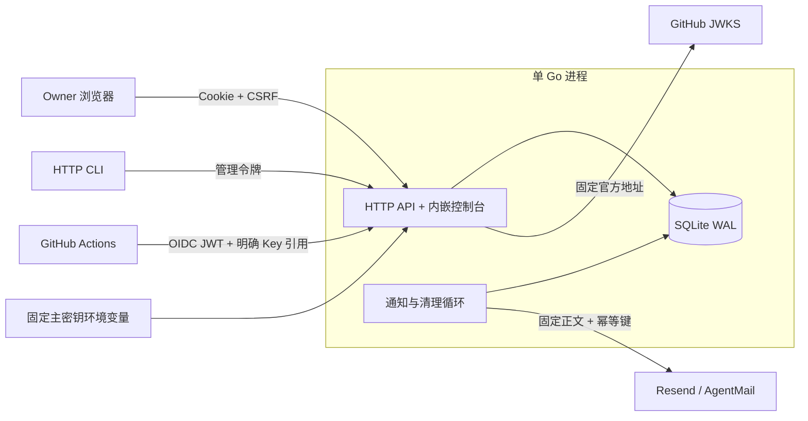

# 内部结构与安全模型

## 数据流

`cmd/civault-server` 负责生命周期；`internal/vault` 统一处理 Web 和 CLI 的身份、授权、验证、事务和审计。`internal/cryptobox` 实现信封加密；`internal/cli` 只通过 HTTP 访问。`web` 编译资源通过 `go:embed` 内嵌。Action 的两个入口共享 OIDC 获取及 Runtime HTTP 客户端。

## 加密边界

每次写入随机生成独立 256 位 DEK，使用 AES-256-GCM 加密 UTF-8 值；固定 256 位主密钥再以 AES-GCM 包装 DEK。两层分别生成 96 位随机 nonce。记录包含格式版本、两层密文和 nonce。

AAD 使用长度前缀编码并隔离 `value` / `dek` 用途，绑定 Key 用途、Workspace ID、Key ID 和版本 ID。系统配置使用不同用途，绑定字段名称和该字段保存时的配置版本。元数据互换、跨 Workspace、跨配置字段和篡改密文都会导致认证失败。

密文内容及身份字段由 SQLite trigger 禁止 UPDATE；生命周期有效期可单独修改并递增 `expiry_revision`。直接操纵数据库仍属于受信任宿主机权限，审计并不是对数据库管理员防篡改的外部账本。

主密钥校验记录在启动时验证。HMAC 用途（OIDC replay、请求指纹、写入幂等请求）通过 HKDF-SHA256 从主密钥分别派生，避免混用 AES 密钥。随机管理令牌和 Session token 仅保存 SHA-256 摘要；密码采用 Argon2id，64 MiB、3 次迭代、4 lanes、随机 16 字节盐。

Go 和 JavaScript 中部分值必然短暂以字符串存在；代码尽可能清除临时字节缓冲区，但不声称可保证托管运行时内存彻底擦除。具有宿主机/进程读取权限的人可以取得内存或主密钥；固定主密钥方案不提供 HSM 的隔离能力。

## Runtime 原子读取

1. 校验 JSON、环境变量名和同工作区显式引用。
2. 验证签名：固定 `https://token.actions.githubusercontent.com` issuer，官方 `/.well-known/jwks`，仅 RS256，单 audience `urn:civault:workspace:<id>`，校验时间及工作负载 Claims，允许 30 秒时钟偏差。忽略 token header 中的远程 key URL。
3. 公钥缓存 1 小时；未知 kid 可触发刷新，全局最短刷新间隔 10 秒。刷新失败或没有仍有效的对应公钥时拒绝。
4. 在 SQLite immediate 事务中读取 Key 状态、标签、当前策略和 replay 记录。
5. 首次选当前版本；重试固定首次版本。每次都重新检查当前 Key、当前规则、当前标签、当前版本和选定版本的有效期。
6. 任意 Key 无授权/禁用/删除/到期/无法解密，整个请求失败。没有部分响应。
7. 持久化 `HMAC(jti)`、请求指纹、首次选定版本、次数；同 JWT 只接受同一请求，60 秒内总计最多 3 次成功交付。提交审计与计数后才返回值。

审计记录实际 Key 版本和命中的策略版本、GitHub repo/run/ref 等元数据。失败也记录拒绝结果；不会记录 JWT、Key 值或请求/响应正文。无效 JSON/引用等协议层错误在授权前返回，不被当作一次成功交付。

## SQLite 与故障一致性

所有连接启用外键、WAL、`synchronous=FULL` 和 5 秒 busy timeout。单连接池配合 immediate 事务串行关键写入，适用于本版单 Owner 单实例规模。版本、策略目标、标签关系有 Workspace 外键约束。

配置更新使用 `revision`，敏感字段未提交则原样保留。改变凭证不影响其他凭证的加密上下文。版本写入幂等键按 actor、Workspace、调用方提供的键隔离；请求指纹包含值的 HMAC，数据库不保存明文请求。

通知先持久化事件、固定正文和发送意图，网络操作在事务外进行，再持久化结果并审计。服务重启后的重试仍使用原幂等键；达到 23 小时边界则要求人工处理。禁用、删除、换版本和改期时在同一业务事务取消已不适用的任务。

## 明确的产品范围

单 Owner；无公开注册、成员角色、Bundle、云 KMS、Redis、独立 Worker、动态凭证签发或第三方 Token 自动轮换。普通列表适用于单 Owner 规模，审计/通知提供分页。Key 删除是逻辑删除，保留历史版本和审计关系，路径不能重复使用。规则版本不可变，因此任何历史版本引用的 Tag 都不能直接删除。

本系统验证 GitHub 签发的 workload 身份，不判断仓库代码是否可信。应在规则中选择适当的事件、Environment、ref 和 workflow SHA，并在 GitHub 侧管理分支保护、Environment 审批及可修改工作流的人员。只限制工作流文件名不足以阻止有权修改该文件的代码获取已授权 Key。

参考：[GitHub OIDC](https://docs.github.com/en/actions/concepts/security/openid-connect)、[GitHub OAuth](https://docs.github.com/en/apps/oauth-apps/building-oauth-apps/authorizing-oauth-apps)、[1Password load-secrets-action](https://github.com/1Password/load-secrets-action)、[Resend 幂等键](https://resend.com/docs/dashboard/emails/idempotency-keys)。
